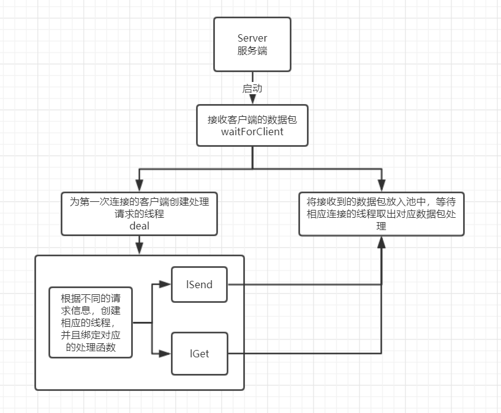
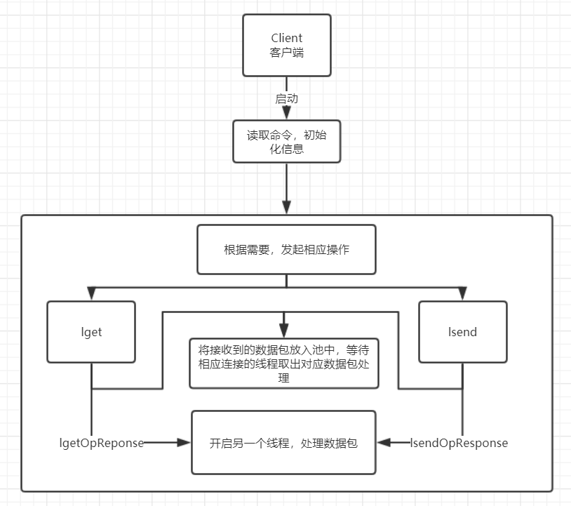
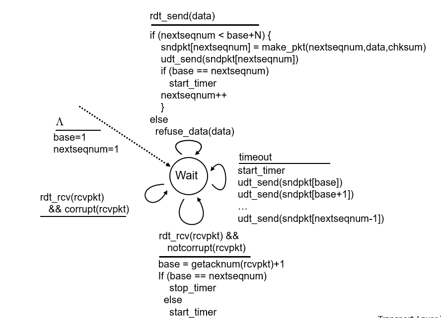
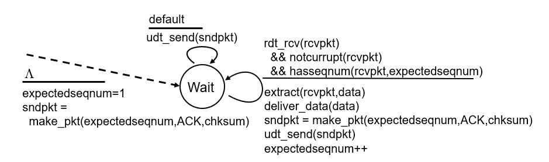
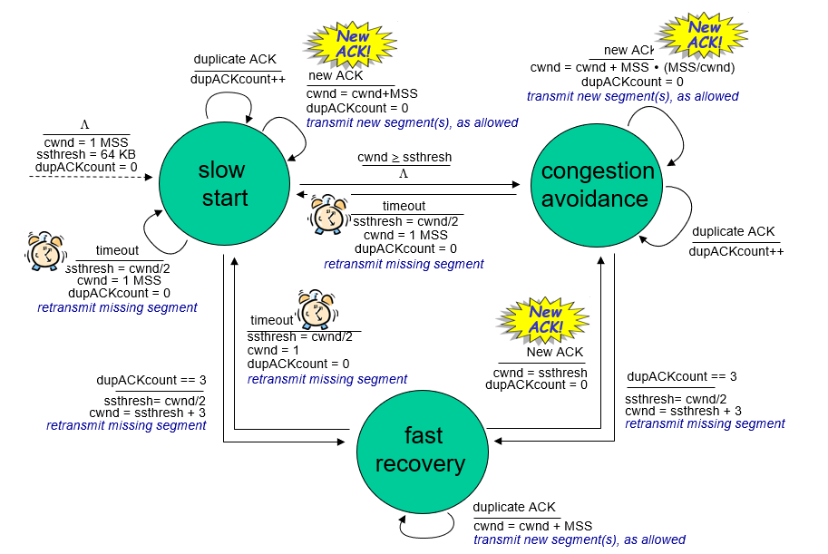
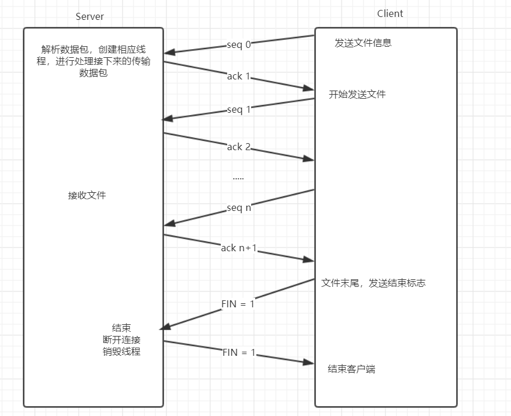
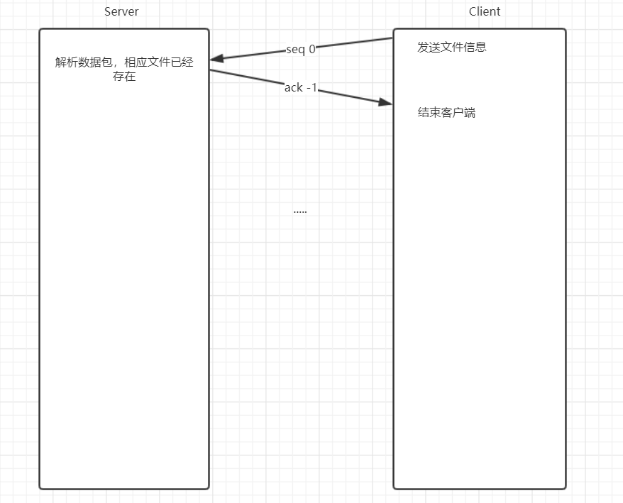
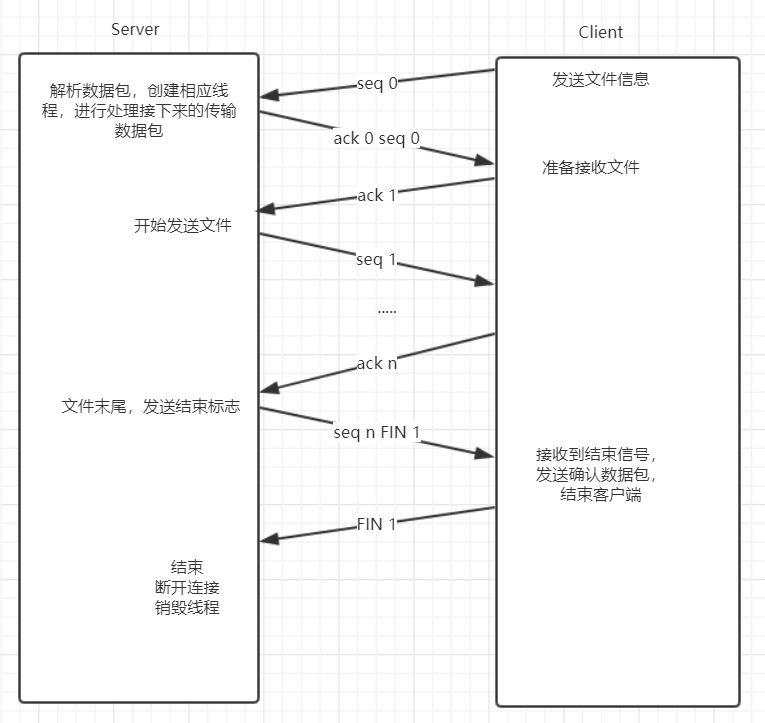
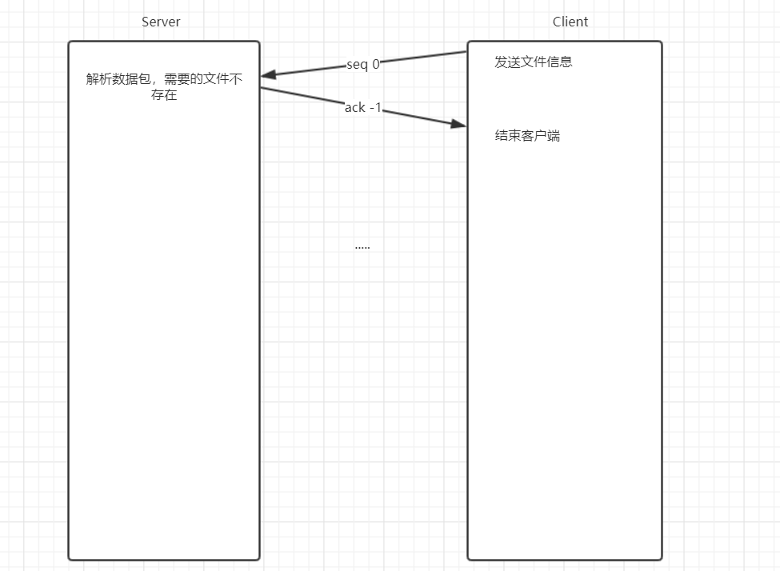

# LFTP 设计文档

## 简介

LFTP，支持两台电脑之间通过互联网传输文件

## 特点
* 基于UDP实现
* 100%可靠传输
* 流量控制
* 拥塞控制
* 支持多客户端同时传输

## 实现设计

### 架构

* 服务器
  
* 客户端
  

### 数据包
本程序的数据包基于UDP数据包，在UDP数据包传输数据部分封装了自己的数据包
<dir>
    <table>
        <caption>UDP数据报文段首部</caption>
        <tr>
            <th align="center">源端口号</th>
            <th align="center">目的端口号</th>
        </tr>
        <tr>
            <td align="center">首部长度</td>
            <td align="center">校验和</td>
        </tr>
        <tr>
            <td colspan="2" align="center">数据</td>
        </tr>
    </table>
</dir>
UDP_PACK数据包放在UDP数据部分进行传输
<dir style="text-align: center">
    <table>
        <caption>UDP_PACK数据报文</caption>
        <tr>
            <th colspan="2" align="center">seq - 序列号</th>
            <th colspan="1" align="center">ack - 确认号</th>
        </tr>
        <tr>
            <td align="center">rwnd - 接收方的接收窗口空闲大小</td>
            <td align="center">FIN - 标志位</td>
            <td align="center">timer - 发包时间</td>
        </tr>
        <tr>
            <td align="center">infoLength - info的长度</td>
            <td align="center">dataLength - data的长度</td>
            <td align="center">totalByte - 发送方发送字节数目</td>
        </tr>
        <tr>
            <td colspan="3" align="center">info -信息</td>
        </tr>
        <tr>
            <td colspan="3" align="center">data - 数据</td>
        </tr>
    </table>
</dir>

### 可靠传输
数据发送使用**流水线协议**，并且使用**GBN协议**，同时设定**超时重传**，当数据包在预设时间内没有收到回复，则重传数据包，保证可靠的数据传输

* GBN
<dir>
    <table>
        <tr>
            <th>Sender</th>
            <th></th>
        </tr>
        <tr>
            <th>Receiver</th>
            <th></th>
        </tr>
    </table>
</dir>

* 超时重传 
    * 创建一个额外的线程用于计时，记录第一个未被确认的数据包的发送时间
        * 设定时间没有接收到回复，重新发送数据包
        * 设定时间内接收到回复，重新计时

### 流量控制
对于每个连接，接收方设定一个固定大小的缓存，在返回确认信息的时候设置设置数据包的`rwnd`，通过此限制发送方的发送数据包的数量和速率，达到流量控制的效果

### 拥塞控制

对于每个连接，发送方维护一个拥塞窗口，初始拥塞窗口`cwnd`的大小为`1 * MSS`，发送窗口小于`cwnd`和`rwnd`

在接收到ack的时候
* 正确的ack，增大拥塞窗口
    * `cwnd`小于等于`ssthresh`的时候，`cwnd`变为增加一倍
    * `cwnd`大于`ssthresh`，`cwnd`加1
* 错误的ack，并且三个冗余，减小拥塞窗口
    * `ssthresh`变成之前的`cwnd`的一半
    * `cwnd`调成`sshresh + 3 * MSS`
* 超时，减小拥塞窗口
    * `ssthresh`变成之前的`cwnd`的一半
    * `cwnd`调成 `1 * MSS`

### 并发传输

服务器需要支持多个客户端同时连接，将客户端的 ip 信息作为该连接的唯一标识，存储数据包的时候按照数据包的信息划分存入到数据池中，当第一次连接的时候开启一个线程专门用来处理这个 ip 相关的数据包，不过这也有不好的地方，就是一个客户端不能够同时进行多个操作，只能等待当前操作完成后才能实现后续操作。每个线程依据创建时候所绑定的信息，处理相关的数据包，实现与客户端数据传输，当然共享数据需要使用锁进行保护，每一次只允许一个线程操作

## 传送文件过程
* `lsend`
    * 正常发送过程
        

    * 假如服务器已经存在该文件，不允许覆盖

        

* `lget`
    * 正常发送过程

        
    
    * 需要的文件不存在

        