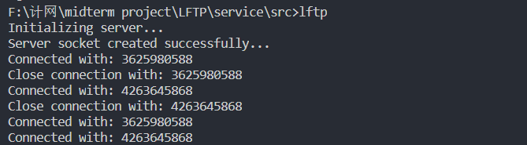

# LFTP 测试文档

## 编译

### 服务端
编译
> 目录  **./service/src**
```g++ server.cpp main.cpp -o LFTP -lwsock32 -std=c++11```

### 客户端
编译
>目录  **./client/src**

```g++ client.cpp main.cpp -o LFTP -lwsock32 -std=c++11```

### 提示
* 相应目录下有已经编译好的可执行文件(`.exe`)
* 每次测试每个客户端主机只测试一个命令，并且每台主机只运行一个客户端

## 测试

### 测试环境
* 系统: `Win 10`
* 三台主机
    * `server`
    * `client 1`、`client 2`


#### 服务器
`./service/src`目录下启动服务，默认使用的端口为`8888`，默认存储数据的文件夹为`./service/data`
```
LFTP.exe    
```

#### 客户端
`./client/src`目录下使用服务，默认存储数据的文件夹为`./client/data`，测试上传文件需要写出文件完整的相对路径

##### 测试下载数据 - `lget`
* 下载文件 `1.mp4` 
    ```
    lftp lget 172.18.32.216:8888 1.mp4
    ```
* 客户端输出日志 -  `log/lget.txt`
    ```
    Initializing client...
    Server socket created successfully...  
    send ack: 0 seq: 0 FIN: 0 rwnd: 50    
    receive: ack: 1 seq: 0 FIN: 0
    send ack: 1 seq: 1 FIN: 0 rwnd: 50
    ...
    receive: ack: 24118 seq: 24166 FIN: 0
    send ack: 24167 seq: 24167 FIN: 0 rwnd: 50
    receive: ack: 24119 seq: 24167 FIN: 1
    send ack: 24168 seq: 24168 FIN: 1 rwnd: 50
    Transfer file 1.mp4 successfully 
    Socket closed...
    ```
* 文件比较，将下载的文件重命名为`client_1.mp4`，服务器的文件重命名为`server_1.mp4`，使用`cmder`的命令`cmp -l`比较二进制文件

    


* 下载服务器不存在的文件
  
    ```
    lftp lget 172.18.32.216:8888 0.mp4
    ```

    

##### 测试上传数据 - `lsend`
* 上传文件 `2.mp4`
    ```
    lftp lsend 172.18.32.216:8888 ../data/2.mp4
    ```
* 客户端输出日志 - `log/lsend.txt`
    ```
    Initializing client...
    Server socket created successfully...
    send ack: 0 seq: 0 FIN: 0 rwnd: 50    
    receive: ack: 1 seq: 0 FIN: 0 rwnd: 100
    send: ack: 1 seq: 1 FIN: 0 rwnd: 100
    ....
    send: ack: 254 seq: 24167 FIN: 1 size: 1539 rwnd: 100
    receive: ack: 24168 seq: 254 FIN: 1 rwnd: 100

    Upload file: 2.mp4 successfully
    Socket closed...
    ```
* 文件比较，将上传的文件重命名为`server_2.mp4`，客户端的文件重命名为`client_2.mp4`，使用`cmder`的命令`cmp -l`比较二进制文件

  

* 上传服务器已经存在的文件，不支持覆盖  

    ```
    lftp lsend 172.18.32.216:8888 ../data/1.mp4
    ```

    

##### 测试并发传输
* 服务端信息
相关连接显示的是客户端的`ip`地址 - `SOCKADD_IN.sin_addr.S_un.S_addr`
